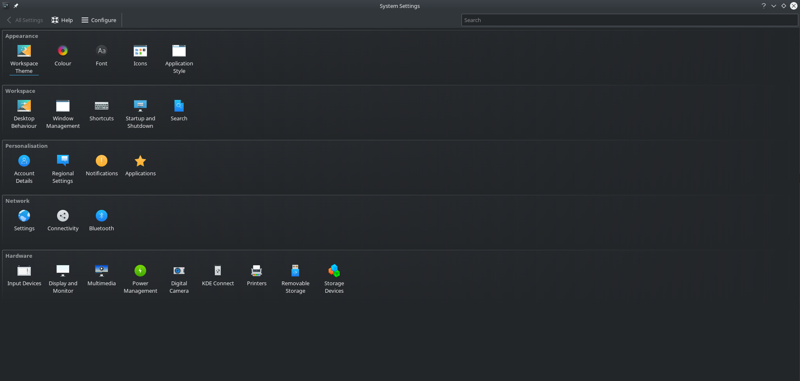
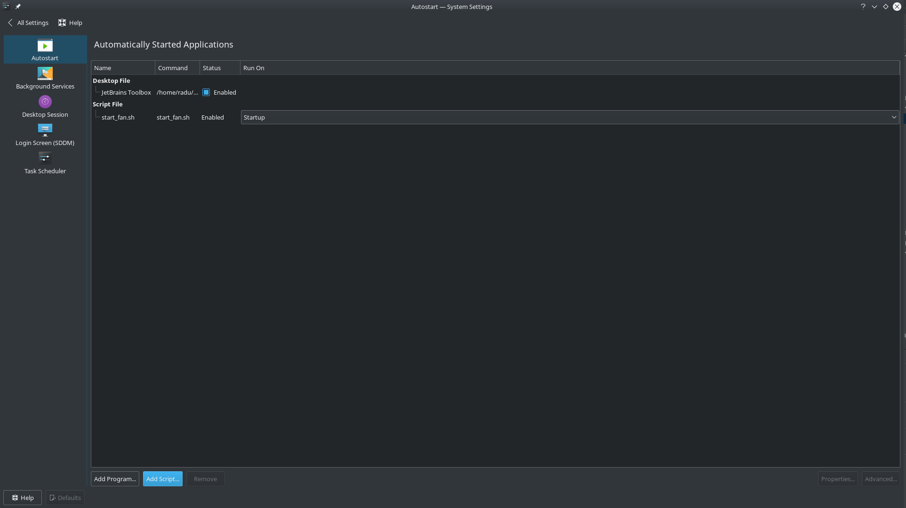

# Nvidia Fan Control Using Python

Code that controls the fan on NVIDIA GPUs using Python 3

## Getting Started

Clone this repository and run python3 app.py --help.
Options available:
```
-r - read current temperature
-s - set the fan speed - values allowed between 0 and 100
```

### Prerequisites

Ensure you have Coolbits set in your /etc/X11/xorg.conf:

From:
```
Section "Device"
    Identifier     "Device0"
    Driver         "nvidia"
    VendorName     "NVIDIA Corporation"
EndSection
```

To:

```
Section "Device"
    Identifier     "Device0"
    Driver         "nvidia"
    VendorName     "NVIDIA Corporation"
    Option         "Coolbits" "31"
EndSection
```
You can use a minimum value of "Coolbits" "4" according to [Nvidia's Forums](https://devtalk.nvidia.com/default/topic/1003810/linux/adjust-nvidia-gpu-fan-speed-multiple-gpus-one-monitor-/)

### Installing

If you wish to run this script when you log in into KDE:
1. Open start_fan.sh and:
- change the directory where the code lives from /home/radu/extra/work/python/nvidia-fan
- set the desired speed
2. Go to System Settings:


</img>


3. Select Startup and Shutdown and click "Add Script..."



</img>

3. Add start_fan.sh to the Autostart.

## Contributing

Please raise an issue if you would like to contribute or send me a message.

## License

This project is licensed under the MIT License - see the [LICENSE.md](LICENSE.md) file for details

